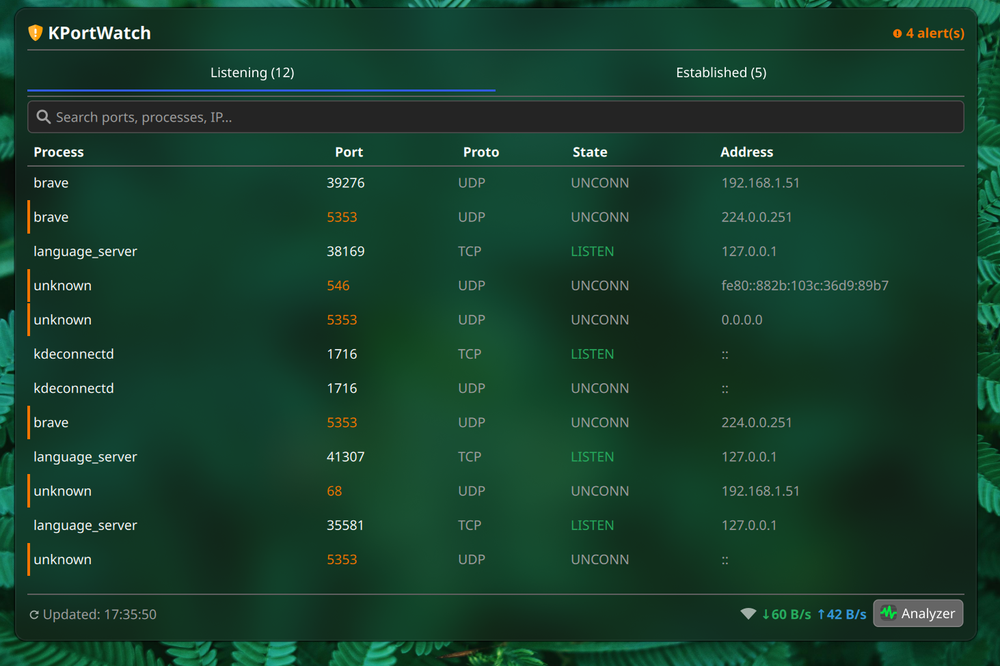
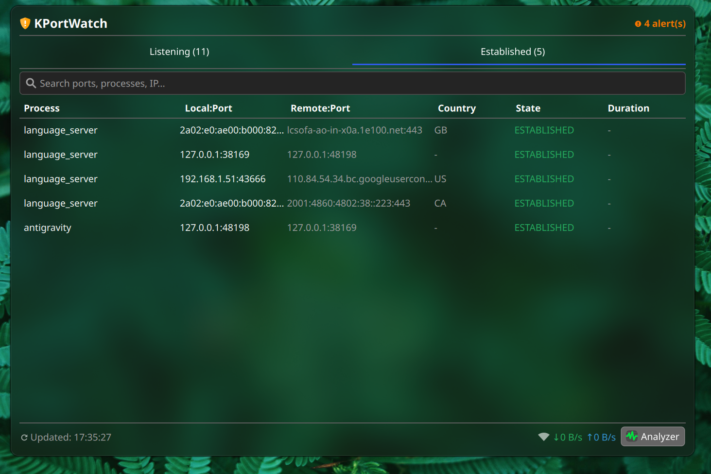
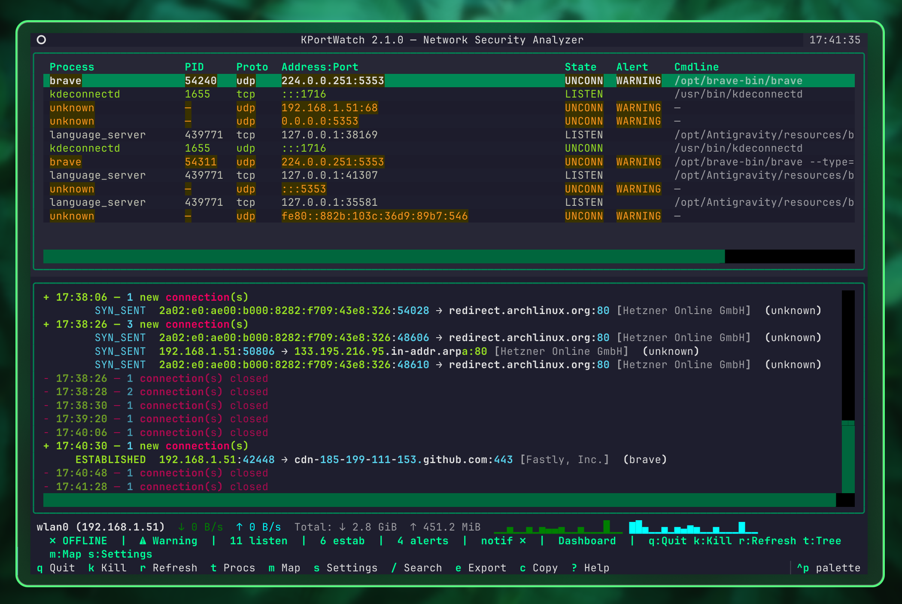
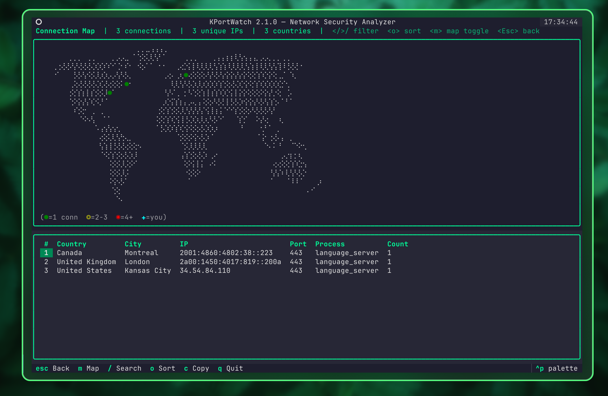
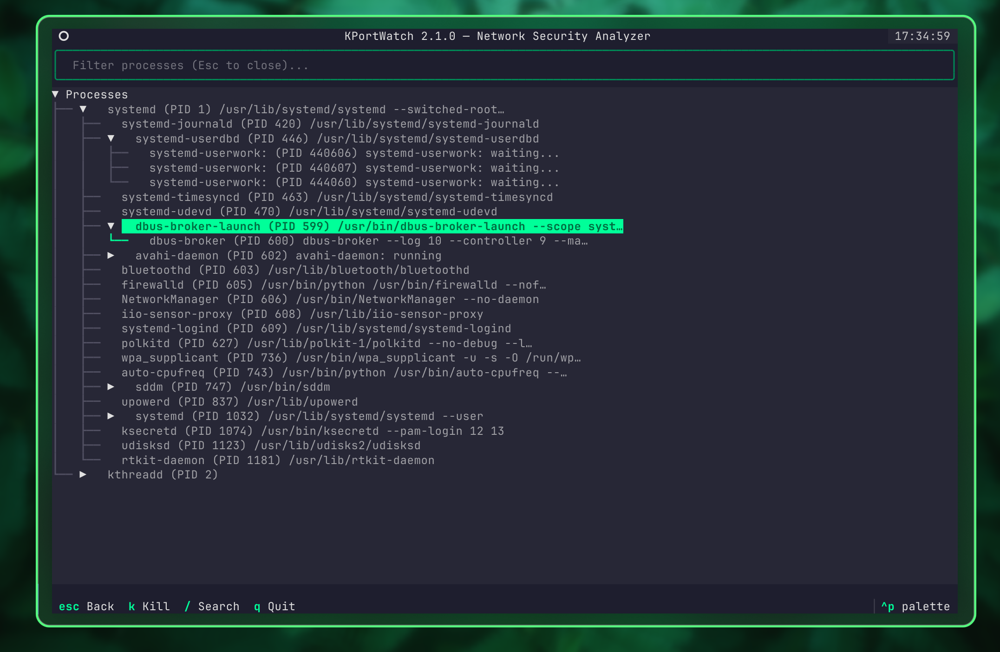

<div align="center">

# KPortWatch

**Local Network Security & Port Monitor**

*A hybrid system tray widget + terminal analyzer for KDE Plasma 6*


</div>

---

## Overview

KPortWatch is a network security monitor for **KDE Plasma 6** on Linux. It watches
your listening and established sockets, alerts you to suspicious activity, and lets
you inspect or terminate connections from either a panel widget or a full-screen
terminal UI.

It is built as three cooperating components:

| Component | Purpose |
|-----------|---------|
| **Plasma 6 Widget** | Real-time passive alerting in your panel — shield icon, port-count badge, and an inline kill button. |
| **Terminal Analyzer (TUI)** | Deep inspection with a split-pane layout, connection map, process tree, and keyboard-driven navigation. |
| **Backend Daemon** | Lightweight socket collector (psutil, with `/proc` as fallback), alert engine, GeoIP/rDNS enrichment, traffic stats, and baseline learning. |

### How it works

```text
  ┌──────────────────────────────────────────────────┐
  │                KERNEL DATA SOURCES                │
  │  psutil sockets   /proc/net/{tcp,udp}{,6}         │
  │  /proc/*/fd   /proc/net/dev   /proc/[pid]/stat     │
  └────────────────────────┬─────────────────────────┘
                           │
            ┌──────────────▼──────────────┐
            │       BACKEND DAEMON        │
            │  • Collect sockets (psutil) │
            │  • Inode → PID mapping      │
            │  • GeoIP + rDNS enrichment  │
            │  • Alert engine + baseline  │
            │  • Traffic stats + deltas   │
            │  • Process tree builder     │
            │  • Desktop notifications    │
            │  • Auto-update checker      │
            └──────┬──────────────┬───────┘
                   │ (Unix socket) │ (JSON)
     ┌─────────────▼──┐    ┌─────▼──────────────┐
     │   PLASMOID     │    │   TUI (Textual)     │
     │  Shield widget │    │  ┌────────────────┐ │
     │  Real-time     │    │  │  Port Table    │ │
     │  Kill action   │    │  ├────────────────┤ │
     │  Alert badge   │    │  │  Connection Log│ │
     └────────────────┘    │  ├────────────────┤ │
                           │  │  Traffic Bar   │ │
                           │  ├────────────────┤ │
                           │  │  Status Bar    │ │
                           │  └────────────────┘ │
                           │  [m] Connection Map │
                           │  [t] Process Tree   │
                           │  [?] Help           │
                           └─────────────────────┘
```

---

## Screenshots

### KDE Plasma 6 Widget

<p align="center">
  
  
</p>

### Terminal UI (TUI) Analyzer

<p align="center">
  
</p>
<p align="center">
  
  
</p>

---

## Features

### Widget (Panel)

- Dynamic shield icon that changes color with the threat level (green / yellow / red).
- Port-count badge showing listening sockets at a glance.
- Popup with a listening-ports table (Process, PID, Proto, Port, Hostname).
- Alert indicators for suspicious activity.
- Inline **Kill Process** button to terminate suspicious connections instantly.
- One-click launch of the advanced TUI analyzer.
- Configurable polling interval, alert threshold, and safe-ports whitelist.

### TUI (Terminal Analyzer)

- Keyboard-driven navigation.
- Stacked layout: port table (top) + connection stream (bottom) + traffic bar.
- Color-coded entries — green (safe), yellow (info), red (critical alert).
- Reverse DNS (rDNS) resolution for remote IPs.
- **Connection Map** — ASCII world map of outbound connections by country, plus a sortable detail table.
- **Process Tree** — hierarchical view of running processes, with network-active processes highlighted.
- Kill a process via a confirmation dialog: SIGTERM (graceful) or SIGKILL (force).
- Copy any row to the clipboard from the port table, connection log, or map table.
- Export the current snapshot to JSON.
- Auto-refresh every 2 seconds.

### Backend Daemon

- Collects sockets through **psutil** (with direct `/proc/net/{tcp,udp}{,6}` parsing as fallback).
- Maps socket inodes to PIDs via `/proc/[pid]/fd/` scanning.
- **Baseline learning** — learns your normal ports during the first run.
- **Desktop notifications** for Warning and Critical alerts (sent by the daemon via `notify-send`).
- **Asynchronous rDNS + GeoIP resolution** with built-in caching.
- **GeoIP lookup** via ipwho.is with a persistent offline cache (`~/.local/share/kportwatch/geoip-cache.json`).
- **Network traffic statistics** — per-interface RX/TX rates from `/proc/net/dev`.
- **Process tree builder** — parent-child relationships with network-activity flags.
- **Unix domain socket** streaming via `kportwatch-client` for low-latency UI updates.
- **History recording** — daily JSON files with summary and alert history.
- **Port risk scoring** — 0–100 score based on malicious ports, baseline, and blacklist.
- **Auto-update** — periodic GitHub release check with optional auto-apply.
- **Daemon heartbeat** — health monitoring via a heartbeat JSON file.
- Adaptive polling — 2 s normal, 1 s on alert, 10 s when idle.

#### Alert rules

| Rule | Level |
|------|-------|
| Port in blacklist / IP in ip_blacklist (fnmatch) | **CRITICAL** |
| Known malicious ports (4444, 5555, 31337, …) | **CRITICAL** |
| Unknown privileged port (< 1024), not known-safe, not baseline | **WARNING** |
| New listening port not in baseline | **INFO** |
| Process with no cmdline | **WARNING** |
| Burst: N+ new ports in one cycle | **WARNING** |
| Custom user rules (from config) | user-defined level |

Custom rules support matching by port, process name, remote IP, and protocol, and you can define per-port / per-IP glob patterns for whitelist and blacklist.

---

## Project Structure

```
kportwatch/
├── backend/                    # Daemon and core logic
│   ├── daemon/                     # Orchestrator + decoupled components
│   │   ├── controller.py               # DaemonController — lifecycle, run loop
│   │   ├── collector.py                # DataCollector — socket entries, tree, traffic
│   │   ├── commands.py                 # CommandHandler — socket commands (kill)
│   │   ├── snapshot.py                 # SnapshotBuilder — risk scores, publish
│   │   ├── notifications.py            # NotificationManager — desktop alerts
│   │   └── updater.py                  # UpdateChecker — version checking
│   ├── daemon_controller.py        # Re-export shim (backward compat)
│   ├── kportwatch_daemon.py        # Main daemon entry point
│   ├── kportwatchctl.py            # CLI client (socket-based)
│   ├── alert_engine.py             # Alert evaluation engine
│   ├── risk_score.py               # Port risk scoring (0–100)
│   ├── history.py                  # History recording (daily JSON)
│   ├── update.py                   # Auto-update checker
│   ├── writers/                    # Data output (JSON, Unix socket)
│   ├── collectors/                 # psutil-based data collection
│   └── parsers/                    # /proc parsers, GeoIP, rDNS
├── tui/                        # Terminal UI (Textual)
│   ├── kportwatch_tui.py            # TUI app entry point
│   ├── data/                        # External data files
│   │   ├── map_loader.py                # World map loader (lru_cache)
│   │   └── worldmap.txt                 # Braille ASCII world map
│   ├── screens/                     # Screens (main, map, tree, settings, help)
│   ├── widgets/                     # Widgets (port table, connection log, traffic bar)
│   ├── themes.py                    # Built-in themes
│   └── utils/                       # Clipboard, data provider
├── widget/                     # KDE Plasma 6 Widget (QML)
│   └── contents/
│       ├── config/                  # Config definitions
│       └── ui/                      # QML UI (main.qml)
├── shared/                     # Shared utilities
│   ├── config/                     # Config package
│   │   ├── __init__.py                 # load_config, get_config, AppConfig
│   │   ├── rules.py                    # CustomRule class
│   │   ├── parsers.py                  # TOML parsing helpers
│   │   ├── persistence.py              # save_config_setting (fcntl lock)
│   │   └── generation.py               # Example config generator
│   ├── constants.py                 # Defaults and paths
│   ├── models.py                    # Data models (SocketEntry, etc.)
│   ├── network.py                   # is_private_ip, CIDR utilities
│   └── fs_utils.py                  # Atomic file writes
├── systemd/                    # systemd service unit
├── polkit/                     # Polkit policy (read + kill actions)
├── scripts/                    # Build & maintenance scripts
│   └── sync-version.py              # Version sync (pyproject.toml ↔ metadata.json)
├── tests/                      # pytest test suite
├── .github/workflows/          # CI (pytest, ruff, ty, bandit, pip-audit, qmllint)
├── install.sh / uninstall.sh
├── pyproject.toml
└── CHANGELOG.md
```

---

## Quick Start

### Prerequisites

- KDE Plasma 6.6+ (Wayland or X11)
- Python 3.11+ (uses the built-in `tomllib`)
- `textual`, `rich`, and `psutil` (auto-installed by the install script)

### Installation

```bash
# Clone
git clone https://github.com/harunkrl/kportwatch.git
cd kportwatch

# System-wide install (widget + systemd service + symlinks)
chmod +x install.sh
./install.sh

# Start the daemon via systemd (auto-starts at boot)
systemctl --user daemon-reload
systemctl --user enable --now kportwatch

# Or run manually in the foreground
kportwatch-daemon --foreground

# Add the widget to your panel
# Right-click panel → Add Widgets → search "KPortWatch"
```

To develop against the source, install editable with dev extras:

```bash
pip install -e ".[dev]"
```

### Uninstallation

```bash
chmod +x uninstall.sh
./uninstall.sh
```

### CLI Commands

| Command | Description |
|---------|-------------|
| `kportwatch-daemon --foreground` | Run the daemon in the foreground (add `--verbose` for detailed logging). |
| `kportwatch-tui` | Launch the TUI analyzer. |
| `kportwatch-client` | Stream live data via the Unix socket. |
| `kportwatch-export` | Export the current snapshot to JSON. |
| `kportwatch-update --check` | Check for available updates. |
| `kportwatch-update --apply` | Apply an available update. |
| `kportwatchctl status` | Query daemon status over the control socket. |

---

## TUI Keyboard Shortcuts

| Key | Action | Screen |
|-----|--------|--------|
| `q` | Quit | Global |
| `?` | Help | Global |
| `k` | Kill selected process | Main, Process Tree |
| `r` | Force data refresh | Main |
| `t` | Open process tree view | Main |
| `m` | Open connection map (GeoIP) | Main |
| `s` | Open settings | Main |
| `e` | Export snapshot to JSON | Main |
| `c` | Copy row to clipboard | Main, Map |
| `/` | Search / filter | Main, Map, Tree |
| `Enter` | Show detail / expand node | Main, Tree |
| `Esc` | Back / close screen | All |

Additional hidden shortcuts: `Ctrl+F` cycles the connection-log filter, and `Ctrl+P`
cycles the protocol filter on the main screen.

> **Tip:** Hold **Shift** + mouse drag to select text in the terminal (bypassing TUI
> mouse capture), then copy with `Ctrl+Shift+C` or middle-click.

---

## Configuration

### TOML Config File

All backend settings are configurable via `~/.config/kportwatch/config.toml`.
Generate an annotated example config:

```bash
python -c "from shared.config import generate_example_config; generate_example_config('/tmp/kportwatch-example.toml')"
cat /tmp/kportwatch-example.toml
```

#### Key Sections

| Section | Key Settings |
|---------|-------------|
| `[polling]` | `interval`, `alert_interval`, `idle_interval`, `idle_threshold_secs` |
| `[security]` | `scan_threshold` — connection burst count that triggers a port-scan alert |
| `[alerts]` | `baseline_duration`, `burst_threshold`, `malicious_ports`, `known_safe_ports` |
| `[dns]` | `cache_size`, `max_pending` |
| `[geoip]` | `enabled`, `api_url`, `cache_file`, `cache_max_entries`, `cache_ttl_days`, `batch_size`, `timeout` |
| `[notifications]` | `enabled`, `min_level`, `alert_ttl`, `rate_limit`, `rate_window` |
| `[update]` | `enabled`, `check_interval`, `auto_apply` |
| `[tui]` | `notifications_enabled`, `color_theme` |
| `[whitelist]` | `ports` — never alert on these |
| `[blacklist]` | `ports`, `ips` — always CRITICAL |
| `[[custom_rules]]` | `match`, `level`, `message` — user-defined alert rules |

#### Example: Custom Alert Rule

```toml
[[custom_rules]]
match = { process_name = "ncat*" }
level = "CRITICAL"
message = "Ncat detected — possible reverse shell"
```

#### Example: GeoIP Configuration

```toml
[geoip]
enabled = true
cache_max_entries = 4096
cache_ttl_days = 7
batch_size = 10
timeout = 5.0
```

### Color Themes

The TUI ships with four themes, selectable in Settings → Theme:

| Display name | Internal key | Style |
|--------------|--------------|-------|
| Cyberpunk | `cyberpunk` | Dark, neon green on near-black |
| Midnight | `nord` | Dark, Nord palette |
| Hacker | `solarized-dark` | Dark, Solarized |
| Daylight | `kpw-light` | Light |

Set the theme in config under `[tui]`:

```toml
[tui]
color_theme = "cyberpunk"
```

### Widget Settings

Accessible via **right-click → Configure**:

| Setting | Default | Description |
|---------|---------|-------------|
| `pollInterval` | 2 | Seconds between data refreshes |
| `alertThreshold` | WARNING | Minimum alert level to display |
| `knownSafePorts` | 22,80,443,631,5353 | Comma-separated safe port list |
| `tuiCommand` | `kportwatch-tui` | TUI launch command |
| `daemonEnabled` | true | Auto-start daemon |

### Auto-Start with systemd

```bash
systemctl --user daemon-reload
systemctl --user enable --now kportwatch

# Check status
systemctl --user status kportwatch

# View logs
journalctl --user -u kportwatch -f
```

---

## Security Model

| Aspect | Details |
|--------|---------|
| **Root required?** | No — `/proc/net/tcp` and psutil data are world-readable. |
| **PID resolution** | Works for user-owned processes without privileges. |
| **System processes** | Shown as "unknown (system)" — root-owned `/proc/*/fd/` requires privilege escalation. |
| **Optional helper** | A Polkit policy is included for full PID visibility. |
| **Kill operations** | Only work for same-user processes by default. |
| **Update security** | GPG signature **mandatory** — unsigned releases are rejected outright. |
| **PID file** | Owner-only permissions (`0o600`) — no world-readable PID leakage. |
| **Command injection** | The widget uses a **whitelist** of allowed commands; unknowns are blocked with a notification. |
| **Baseline integrity** | SHA-256 checksum on save, verified on load — tampering rebuilds the baseline. |
| **GeoIP privacy** | Only public remote IPs are looked up; results cached locally; no tracking. |

### Privilege Escalation (Optional)

For full system-wide PID visibility, choose one:

```bash
# Option A: sudoers rule (run ss without a password for the daemon)
echo "YOUR_USER ALL=(root) NOPASSWD: /usr/bin/ss -tulnp" | sudo tee /etc/sudoers.d/kportwatch

# Option B: Polkit policy (included, recommended) — manual install
sudo cp polkit/com.kportwatch.helper.policy /usr/share/polkit-1/actions/
```

`install.sh` installs the Polkit policy automatically. It routes both the read
(`getports`) and kill (`kill`) actions through `~/.local/bin/kportwatchctl`.

| Action | Polkit rule | Effect |
|--------|-------------|--------|
| `com.kportwatch.helper.getports` | `auth_self_keep` | Authentication cached briefly after the first prompt. |
| `com.kportwatch.helper.kill` | `auth_admin_keep` | Admin authentication cached briefly after the first prompt. |

> The `_keep` suffix means authentication is remembered for a short window, so you
> are not re-prompted on every call within that window.

---

## Architecture Decisions

| Decision | Rationale |
|----------|-----------|
| psutil first, `/proc/net/` fallback | psutil is robust and cross-distro; direct `/proc` parsing is a zero-dependency fallback. |
| Inode → PID via `/proc/*/fd/` scanning | No root needed for user processes (~45 ms per scan). |
| Atomic JSON file (write → rename) | Prevents partial reads; works across all consumers. |
| Textual for the TUI | Modern Python TUI framework, Wayland-native, rich styling. |
| `Plasma5Support.DataSource` for the widget | Standard Plasma 6 pattern for polling external data. |
| Adaptive polling intervals | Minimizes CPU when idle; maximizes responsiveness on alerts. |
| TOML config file | Human-readable, type-safe, standard Python (`tomllib`). |
| GeoIP with persistent cache | Offline capability; respects API rate limits (~10,000 req/day). |
| Config decomposition | 540-line monolith → 5 focused modules with an identical public API. |

---

## Known Limitations

- Non-root users can only resolve PIDs for their own processes.
- UDP "connections" are stateless — shown as `UNCONN` in the table.
- `TIME_WAIT`, `CLOSE_WAIT`, etc. are grouped under "established" (active).
- GeoIP accuracy depends on the ipwho.is database — some IPs may return approximate locations.
- The ASCII world map is coarse (80 × 20); small countries may overlap.
- The `executable` DataEngine is deprecated in future Plasma versions (6.7+).

---

## Tech Stack

| Component | Technology |
|-----------|-----------|
| Widget | QML, Kirigami, Plasma 6 `Plasma5Support` |
| TUI | Python Textual, Rich |
| Backend | Python 3.11+ (psutil ≥ 5.9) |
| Config | TOML (Python 3.11+ `tomllib`) |
| IPC | JSON file via atomic rename + Unix domain socket |
| GeoIP | ipwho.is (free tier, HTTPS) + persistent JSON cache |
| Desktop | KDE Plasma 6.6, Qt 6, Wayland |

---

## License

This project is licensed under the **MIT** License.

---

<div align="center">

Built for KDE Plasma 6 on Linux.

</div>
